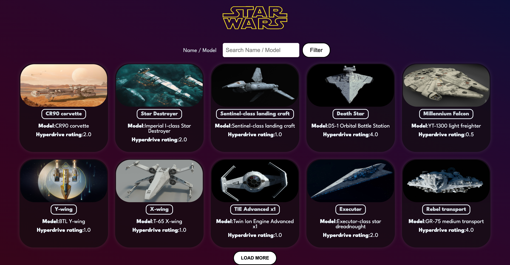
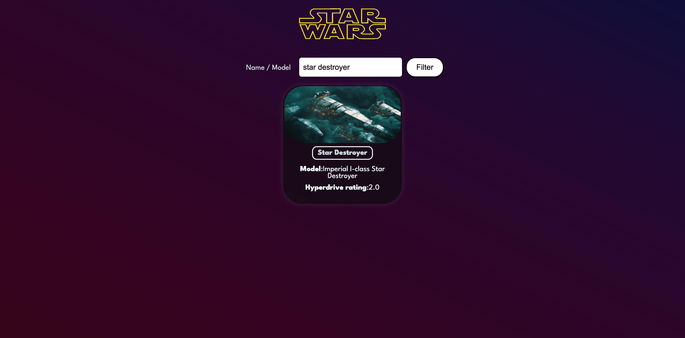
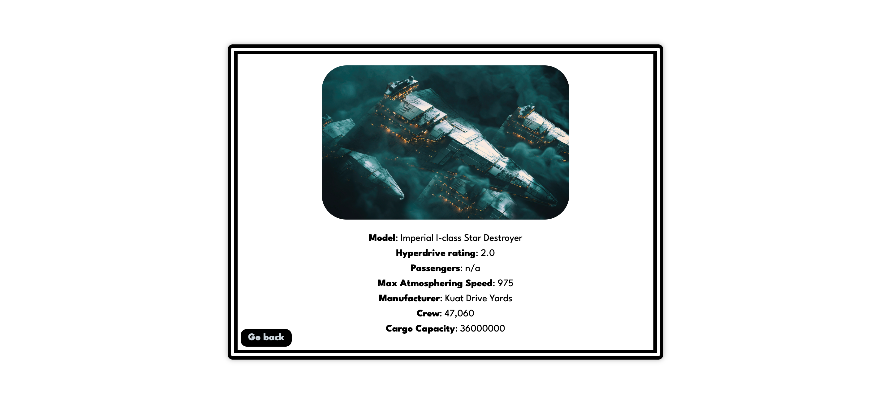

# Starwars Ships

This is a Star Wars Ships search app built with React that allows users to search for starships used in the Star Wars universe. The app retrieves data from the Star Wars API (SWAPI) and displays it in a user-friendly format. Users can search for ships by name or model, and click on them for further detail.

## Preview

Live Site URL: [Star Wars Ships](https://omeryaz.github.io/starwars-ships/)

### Home Page

### Filtering

### Detail Page

## Utilized Technologies

- Javascript
- CSS
- React 18.2
- React Router 6.11

## License

[MIT](https://choosealicense.com/licenses/mit/)
